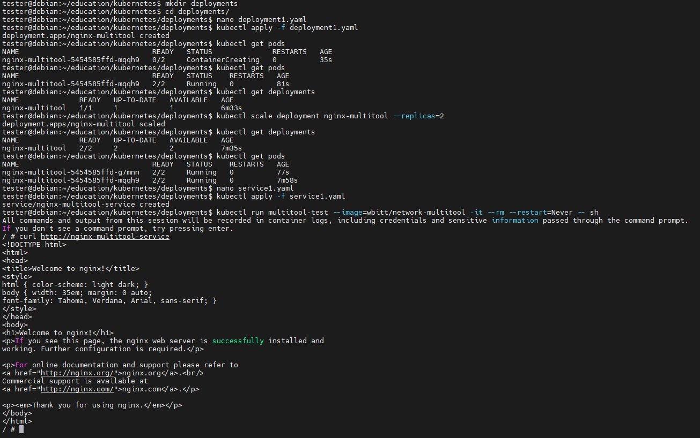
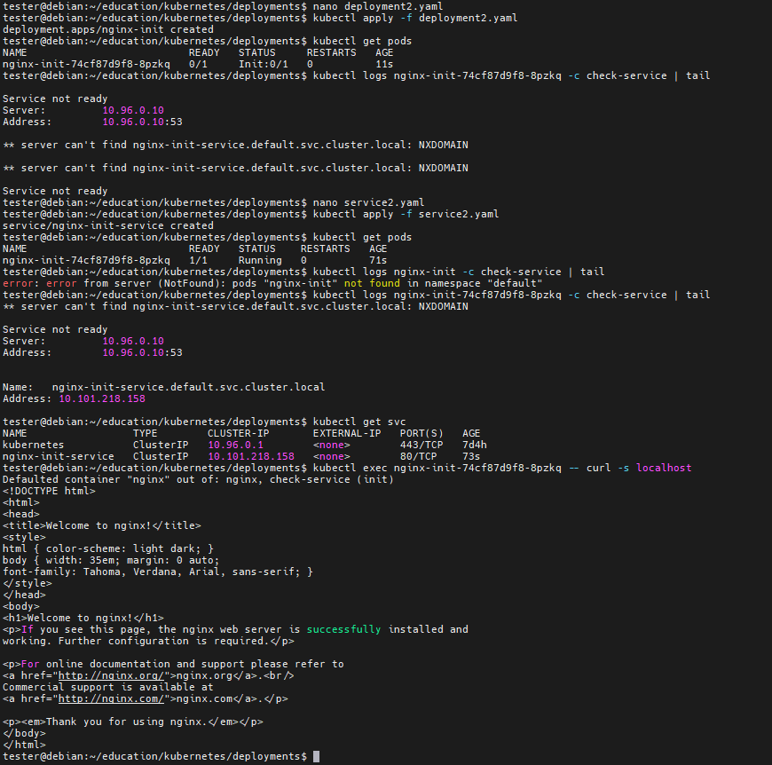

# Домашнее задание к занятию «Запуск приложений в K8S»

## Описание заданий

https://github.com/netology-code/kuber-homeworks/blob/main/1.3/1.3.md

### Цель

В тестовой среде для работы с Kubernetes, установленной в предыдущем ДЗ, необходимо развернуть Deployment с приложением, состоящим из нескольких контейнеров, и масштабировать его.

------

### Чеклист готовности к домашнему заданию

1. Установленное k8s-решение (например, MicroK8S).
2. Установленный локальный kubectl.
3. Редактор YAML-файлов с подключённым git-репозиторием.

------

### Инструменты и дополнительные материалы, которые пригодятся для выполнения задания

1. [Описание](https://kubernetes.io/docs/concepts/workloads/controllers/deployment/) Deployment и примеры манифестов.
2. [Описание](https://kubernetes.io/docs/concepts/workloads/pods/init-containers/) Init-контейнеров.
3. [Описание](https://github.com/wbitt/Network-MultiTool) Multitool.

------

### Задание 1. Создать Deployment и обеспечить доступ к репликам приложения из другого Pod

1. Создать Deployment приложения, состоящего из двух контейнеров — nginx и multitool. Решить возникшую ошибку.
2. После запуска увеличить количество реплик работающего приложения до 2.
3. Продемонстрировать количество подов до и после масштабирования.
4. Создать Service, который обеспечит доступ до реплик приложений из п.1.
5. Создать отдельный Pod с приложением multitool и убедиться с помощью `curl`, что из пода есть доступ до приложений из п.1.

------

### Задание 2. Создать Deployment и обеспечить старт основного контейнера при выполнении условий

1. Создать Deployment приложения nginx и обеспечить старт контейнера только после того, как будет запущен сервис этого приложения.
2. Убедиться, что nginx не стартует. В качестве Init-контейнера взять busybox.
3. Создать и запустить Service. Убедиться, что Init запустился.
4. Продемонстрировать состояние пода до и после запуска сервиса.

------

## Выполнение заданий

### Чек окружения

    Debian 12 x86_64

    minikube - https://minikube.sigs.k8s.io/docs/start/

    docker - https://www.docker.com/get-started/

    local kubectl - https://kubernetes.io/docs/tasks/tools/install-kubectl-linux/

    ```
    # docker ready

    # install minikube
    curl -LO https://storage.googleapis.com/minikube/releases/latest/minikube_latest_amd64.deb
    sudo dpkg -i minikube_latest_amd64.deb
    minikube start
    minikube status

    # local kubectl
    curl -LO "https://dl.k8s.io/release/$(curl -L -s https://dl.k8s.io/release/stable.txt)/bin/linux/amd64/kubectl"
    sudo install -o root -g root -m 0755 kubectl /usr/local/bin/kubectl
    kubectl version --client
    kubectl get nodes

    ```

### Решение 1

Создаём deployment1.yaml
```
apiVersion: apps/v1
kind: Deployment
metadata:
  name: nginx-multitool
  labels:
    app: nginx-multitool
spec:
  replicas: 1
  selector:
    matchLabels:
      app: nginx-multitool
  template:
    metadata:
      labels:
        app: nginx-multitool
    spec:
      containers:
      - name: nginx
        image: nginx:latest
        ports:
        - containerPort: 80
      - name: multitool
        image: wbitt/network-multitool
        ports:
        - containerPort: 8080  # Изменён порт для избежания конфликта
        command: ["sh", "-c", "sleep infinity"]  # Предотвращаем завершение контейнера
```
Запускаем deployment1
```
kubectl apply -f deployment1.yaml
```
Проверяем количество подов до масштабирования
```
kubectl get deployments # 1
kubectl get pods # должно быть 2
```
Увеличиваем количество реплик работающего приложения до 2
```
kubectl scale deployment nginx-multitool --replicas=2
```
Проверяем количество подов после масштабирования
```
kubectl get deployments # 2
kubectl get pods # должно быть 4
```
Создаём Service, который обеспечит доступ до реплик приложений, через описание в service1.yaml
```
apiVersion: v1
kind: Service
metadata:
  name: nginx-multitool-service
spec:
  selector:
    app: nginx-multitool
  ports:
    - protocol: TCP
      port: 80 # Порт сервиса внутри кластера
      targetPort: 80  # Порт контейнера nginx
```
Запускаем service1
```
kubectl apply -f service1.yaml
```
Создаём отдельный под с приложением multitool и убеждаемся с помощью `curl`, что из пода есть доступ до приложений
```
kubectl run multitool-test --image=wbitt/network-multitool -it --rm --restart=Never -- sh
curl http://nginx-multitool-service
```
Результаты



Чистим всё
```
kubectl delete svc/nginx-multitool-service
kubectl delete deployment/nginx-multitool
```

### Решение 2

Создаём deployment2.yaml
```
apiVersion: apps/v1
kind: Deployment
metadata:
  name: nginx-init
  labels:
    app: nginx-init
spec:
  replicas: 1
  selector:
    matchLabels:
      app: nginx-init
  template:
    metadata:
      labels:
        app: nginx-init
    spec:
      initContainers:
      - name: check-service
        image: busybox:latest
        command: ['sh', '-c', 'until nslookup nginx-init-service.default.svc.cluster.local; do echo "Service not ready"; sleep 2; done']
      containers:
      - name: nginx
        image: nginx:latest
        ports:
        - containerPort: 80
```
Запускаем deployment2
```
kubectl apply -f deployment2.yaml
```
Проверяем объекты и статусы
```
kubectl get pods
kubectl logs nginx-init -c check-service | tail
```
Создаём service2.yaml
```
apiVersion: v1
kind: Service
metadata:
  name: nginx-init-service
spec:
  selector:
    app: nginx-init
  ports:
    - protocol: TCP
      port: 80
      targetPort: 80
```
Запускаем service2.yaml
```
kubectl apply -f service2.yaml
```
Снова получаем статус пода
```
kubectl get pods
kubectl logs nginx-init -c check-service | tail
```
Проверка работы nginx
```
kubectl exec nginx-init -- curl -s localhost
```
Результаты



Чистим всё
```
kubectl delete -f deployment2.yaml
kubectl delete -f service2.yaml
```